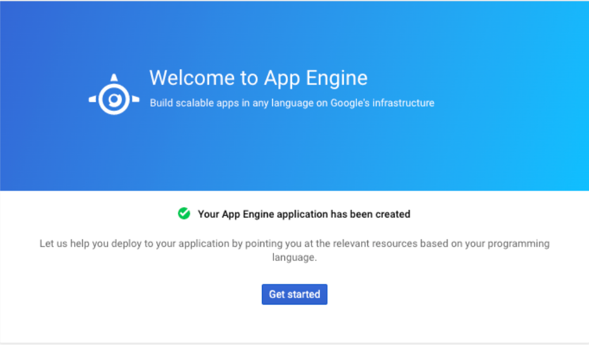

# Introduction to HashiCorp Vault

Go PASSWORDLESS for your application with HashiCorp Vault! With credentials being hacked and stolen every day, passwords need to change just as frequently to circumvent any vulnerabilities. 
With HashiCorp Vault, your application secrets will be secured and rotated automatically in the background, eliminating your password maintenance requirements.
For More details -> [HashiCorp Vault](https://in.accenture.com/connectivitysecurity/pam-hashicorp/)

# Important Note

All Data Platform GCP sample pipelines are configured to use the Terraform Back-End State configuration to store the Terraform state using an Azure blob storage account where the state is saved.
Therefore, it is required to be deployed prior to any other pipeline in your GCP processing project. Otherwise, your pipelines will fail.

**After Mar 7, 2023, HashiVault GCP terraform backend is introduced, all new GCP onboard customers by default store the terraform state files as Blob(s) within the NEW central Blob Storage Account st506405use2tfstate** please follow this link [What Terraform Backend, blob storage account, and authentication method are being Used in CIO](https://ciodeveloper.accenture.com/cio_cartridge/cloud2_cartridge/gcp/common/hashivault-cloud-cartridge-integration-tfbackend-overview/) for more details.

To unlock terraform state file in Cloud2.0 Cartridge for GCP [How to unlock terraform state file in Cloud2.0 Cartridge for GCP](https://ciodeveloper.accenture.com/cio_cartridge/cloud2_cartridge/gcp/common/how-to-unlock-tf-state-in-azurerm-for-gcp/) 

If any queries or encounter any issues when using the pipelines generated by Cartridge, please feel free to contact IAC team by creating a new Incident in [Accenture Support - ITIL](https://support.accenture.com/nav_to.do?uri=%2Fhome.do) (Service Now) and assigning the incident to the INFRADELV-INFRA-CLOUD-IAC queue.

# Introduction
The purpose of this project is to serve as an example of a CloudFunction with scheduling the YML template pipeline that use the CF and scheduler module. On the scope of this document also include the YML pipeline that deploy CF and Cloud Scheduler. 

# Prerequisite
* To use Cloud Scheduler, App Engine application should be activated.
* To activate App Engine application for a project refer this [link](https://dev.azure.com/accenturecio26/AIA00e8EngSvs_149776/_git/aia-tf-platform-hashi-examples-65343?path=/AppEngine)

we can check if our App Engine Application has been properly activated looking on GCP console as below.



# Pipeline
Here we can create build and release pipeline using mentioned YML files.
```
Build pipeline --> cf_scheduler_build.yml
This is a wrapper yml used as a Build Pipeline.. this is using build-template.yml under azure-pipelines-template and running all tasks related to Build process.

Release pipeline --> cf_scheduler_release.yml
This is a wrapper yml used as a Release Pipeline.. this is using release-cs** and release-destroy** under azure-pipelines-template ; running all tasks related to deploy/destroy process.
Here the Cloud Function is triggered based on the schedule set under cloud scheduler.
```
## Variables
There are two kind of variables :
* Pipeline variables: There is a variable file **common-variables.yml** as well in folder env-config. Variables that are used inside the pipeline can be used as per requirement but  do not change based on project/env. 
This Read Me file is a template for variables used inside the pipeline independent of the environment

* Variable groups: 
Here we are using  3 variable groups for **CloudFunction** & 3 Variable groups for **Cloud Scheduler** that should pre-exist prior to running pipelines.
```
cfgen2-sm-http-hashi-sbx --> This is picked up when the pipeline branch name is for sandbox.
cfgen2-sm-http-hashi-npd --> This is picked up when the pipeline branch name is for Nonproduction.
cfgen2-sm-http-hashi-prd --> This is picked up when the pipeline branch name is for Production.
```
```
cfgen2-cloudscheduler-sm-http-hashi-sbx --> This is picked up when the pipeline branch name is for Sandbox.
cfgen2-cloudscheduler-sm-http-hashi-npd --> This is picked up when the pipeline branch name is for Nonproduction.
cfgen2-cloudscheduler-sm-http-hashi-prd --> This is picked up when the pipeline branch name is for Production.
```
All the values we want to replace in our scripts or codes should be instanced here.

### List of variables and guidance: CloudFunction

Navigate to the variable group section under Library and provide the values for the variables listed below

**Variable Name** | **Variable Value Description**
--- | --- |
AIR_ID | Specify your AIR ID
AZURE_USER | Application User ID. AZURE_PASS & AZURE_USER variables are used for Auto Destroy Functionality. Note: In the sandbox you can use dummy values because the auto destroy functionality is meant to work in non-prod & production. To get the Application user ID in production find the links in the [circle](https://circles.accenture.com/3d8eddce-97ef-49b8-bd7b-91cdabc21667?tab=home) for application ID creation in Accenture active directory.
cf_cs_build_pipeline | Need to provide your Cloud Function build pipeline name.
CF_ENTRYPOINT | We can give any name here. It is the main function that will be trigger
CF_NAME | We can give any name here. It is the Cloud Function name.
GCP_BUCKET_NAME | GCP Bucket Name - No need to change - Any value we can provide here – This will be created by terraform module with the name which you provide in variable value
GCP_CF_BUCKET_NAME | GCP Pub/Sub Bucket Name - No need to change - Any value we can provide here – This will be created by terraform module with the name which you provide in variable value
GCP_DATALAKE_PROJECT_ID | Need to provide your GCP Datalake Project ID
GCP_DATALAKE_SA | Need to provide your GCP Datalake Service Account
GCP_DATASET_ID | Need to provide your GCP existing Dataset ID
GCP_OPERATION_SA_NAME | GCP Service Account that would have permissions for different big data service operations – We will get this big data service account from GCP console under IAM Service Accounts(Under your project).
GCP_OWNER_SA_NAME | GCP Service Account with owner privileges (This is been used while creation of cloud function) - We will get this owner service account from GCP console under IAM Service Accounts(Under your project).
GCP_PROJECT_ID | Need to provide your GCP Project ID
GCP_PROJECT_REGION | Specify project region
GCP_PROJECT_VPC | The name of the VPC - No need to change.
GCP_PROJECT_ZONE | Specify Project Zone
GCP_SM_ENV_NAME | Specify the enviroment for Secret Manager.
pylint_min_rank | Minimum rank for pylint task.
pylint_version | Stable version of pylint can be used (The version which we are using is stable for now).
PYTHON_VERSION | Version of Python - No need to change.
TF_STATE_FILES_BUCKET | GCP Bucket to store TF state files – Change as per the environment which we want to deploy(SBX/NPD/PRD).
skipMultipleExecution | To skip the multiple execution of tasks in each stage - No need to change.(Can directly declare this variable in Build Pipeline Variables as shown in Build Pipeline Video)
GCP_ROLESET_NAME | GCP roleset should be specified. [{GCP_Project_Name-k} Ex: sbx-149776-devarchhash5-bd-k]. It will generate after project provision got completed with name "Vault GCP IaC Role Name"
HASHI_ENDPOINT | Specify Hashi endpoint. This variable configuration is a connection to HashiCorp Vault. The hashi endpoint will be of this format AIR_ID-ENV-HASHIVAULT (Example:- 149776-NPD-HashiVault-STG). More details available here -> [HashiCorp Vault](https://in.accenture.com/connectivitysecurity/pam-hashicorp/)
SECRET_ENV | Specify Secret environment. {Ex: SBX, NPD, PRD}
AZ_ROLESET_NAME | Azure roleset should be specified. [{env-airid-iac-tf-gcp-2.0} Ex: sbx-149776-iac-tf-gcp-2.0]. It will generate after project provision got completed with name "Vault GCP TF Role Name"
CONTAINER_NAME | Container name should be specified. [{cio-projairidenvtfstate} Ex: cio-proj149776sbxtfstate].
RG_NAME | The name of the Resource Group - No need to change.
SA_NAME | The name of the Storage Account - No need to change.
SUBSCRIPTION_ID & TENANT_ID | Specify the Subscription and Tenant ID as per the environment. More details available here -> [Azure AD integration Endpoints](https://in.accenture.com/enterprisesignonintegration/azure-integrations/azure-ad-endpoints/)

### List of variables and guidance: Cloud scheduler

Navigate to the variable group section under Library and provide the values for the variables listed below

**Variable Name** | **Variable Value Description**
--- | --- |
cf_cs_build_pipeline | Need to provide your Cloud scheduler build pipeline name.
GCP_CS_DESCRIPTION | A short description about what the job role. Must not contain more than 500 characters.
GCP_CS_PAYLOAD | The message payload for PubsubMessage, which must contain non-empty data.
GCP_CS_SCHEDULE | Describes the schedule on which the job will be executed, in unix-cron format.
GCP_CS_TIMEZONE | Specifies the time zone to be used in interpreting schedule.
GCP_CS_SM_NAME | GCP Secret Manager Name for Cloud Scheduler - No need to change - Any value we can provide here – This will be created by terraform module with the name which you provide in variable value

# Templates

We have 3 YML files below which consume tasks from templates.
```
build-template.yml ::-- This file is called from cloudschedule_cf_e2e_build.yml and this is consuming build task templates from the folder build-task-templates.
release-cs-deploy-template.yml ::- This file is used for cloud scheduler and cloud function creation. it is being called from cloudschedule_cf_e2e_release.yml and this is consuming release destroy task templates from the folder release-task-templates.
release-cs-destroy-template.yml ::- This file is used for cloud scheduler and cloud function destruction. it is being called from cloudschedule_cf_e2e_release.yml and this is consuming release destroy task templates from the folder release-task-templates.
```
cloudschedule_cf_e2e_release.yml consumes a parameter "action" . Based on the value for it, consumes from either ** release-deploy or release-destroy** files.

# build-task-templates

In this example we are using build task templates.
Once we settle down with YML pipelines, in future we may push the generalized tasks for build and release pipelines to cartridges and they can be consumed from there only in order to keep the consistency and control.

Follow these steps for each template:
### airflow-listDag.yml
```
This template can be used to check DAGs syntactically.
It lists all the DAGs which are good to install and shows DAGs with issues.
It takes parameters as GCP_PROJECT_ID, jobname and PYTHON_VERSION
```
#### BQ-code-analysis.yml
```
This template can is for BQ code analysis.
It scans the queries for certain thresholds and cautionary conditions.
```
Check for the thresholds as per the coding standards 
* [Code Review checklist](https://ts.accenture.com/:x:/r/sites/CIOAnalyticsPlatform/_layouts/15/Doc.aspx?sourcedoc=%7BB406B7FE-3908-4095-8C2B-C723D5B31000%7D&file=AIA%20-%20Composer%20-%20Code%20Review%20Checklist.xlsx&action=default&mobileredirect=true)

#### BQ-dry-run.yml
```
This template is for BQ dry runs.
It estimates how many memory bytes it will take when the Query runs on GCP.
Thresholds can be placed to this and if the query crosses the threshold, then the task would Fail.
```
For additional details find the below links.
* [Dry Run Queries](https://cloud.google.com/bigquery/docs/dry-run-queries)
* [Big Query Dry Runner](https://blog.accenture.com/cio_hr_reporting_and_sdm/2020/06/08/big-query-dry-runner/)

#### build-archive.yml
```
This template is for building artifacts.
It takes the artifacts Folder and then archives it.
```
#### build-publish.yml
```
This template is for publishing artifacts.
It publishes the artifacts name through the path for publishing.
```
#### pylint-check.yml
```
This template is for Pylint code scan check.
It measures the code quality and provides a rank out of 10.
If a threshold is passed then it would fail the task if the rank is below pylint_min_rank then it fails the task.
```
# release-task-templates

In this example we are using release task templates.
Once we settle down with YML pipelines, in future we may push the generalized tasks for build and release pipelines to cartridges and they can be consumed from there only in order to keep the consistency and control.

Below are the steps for each template:

#### download-pipeline-artifacts.yml
```
This template if about how to download pipeline artifacts.
It takes parameters as build_pipeline_name of which artifacts to be downloaded
```
#### hashicorp_vault_credentials.yml
```
This template can be used to retrieve requested secrets/credentials from the HashiCorp Vault.
HashiCorp Vault enables organizations to securely store and tightly control access to tokens, passwords, certificates, and encryption keys to protect secrets and other sensitive data across multiple clouds.
```
#### hashicorp_vault_remove_lease.yml
```
This template can be used to remove the requested Hashi Lease Id.
```
#### post-build-cleanup.yml
```
The Post Build Cleanup task deletes unwanted files from your build agent,
after your build has run, thus, saving precious disk space.
```
### prepare-tf-code.yml
```
This template is for preparing code for deployment
```
#### Scan-tasks.yml
```
This template is for SAST and http scan compliance checks.
It takes parameter such as AIR_ID.
```
The SAST Security Scan Task is used to scan your repository code for security vulnerabilities.

### tf_registry_connection.yml
```
This template if for connecting to CCS TF registry and using
all the available modules there.
```
### tf-deploy.yml
```
This template is for tf resource creation. 
It takes input as a working directory where tf files will exist.
It also takes care  of any potential issues in the resource creation or taint resources created.
```
### tf-destroy.yml
```
This template can be used for tf resource destruction.
It takes input as a working directory where tf files would exist.
It also takes care of deleting CloudFunction temp buckets.
It also uses the keyFile while removing the buckets for CloudFunction.
```
### token-replacement.yml
```
This template is used to replace the variables in tf files with pipeline var values.
It takes input as an object where user needs to provide a list per below format
[{dir_name:"", file_list:["file1","file2",...]},{},{},{},...]
here dir_name is the name of directory name
here file_list is the list of files in mentioned directory
```
### Unzip-dags.yml
```
This template is for unzipping the artifacts
```
# Terraform code
There are three files for terraform:
* tokenized.terraform.\_tfvars
* variables.tf
* main.tf

### variables.tf
```
On this files we define the varibles that we are going to use on our terraform script.
```
### tokenized.terraform.\_tfvars
```
Here we give a value to our variables. As we wanna to use the variables defined on the pipeline we just write their name surrendered by `#{` and `}#` so on the tokenised step the name of the variables will be replaced by the appropriated value.
```
### main.tf
```
On the first lines of the *main.tf* file we declare the providers. We need two *google* and *google-eta*.

On the next step we declare the *backend* to keep the terraform state so we can recover it from other stages.

In case of tf_cs_code, Next we declare the project and call to the cloud scheduler and cloud function module. We should specify the module source and version. 
```